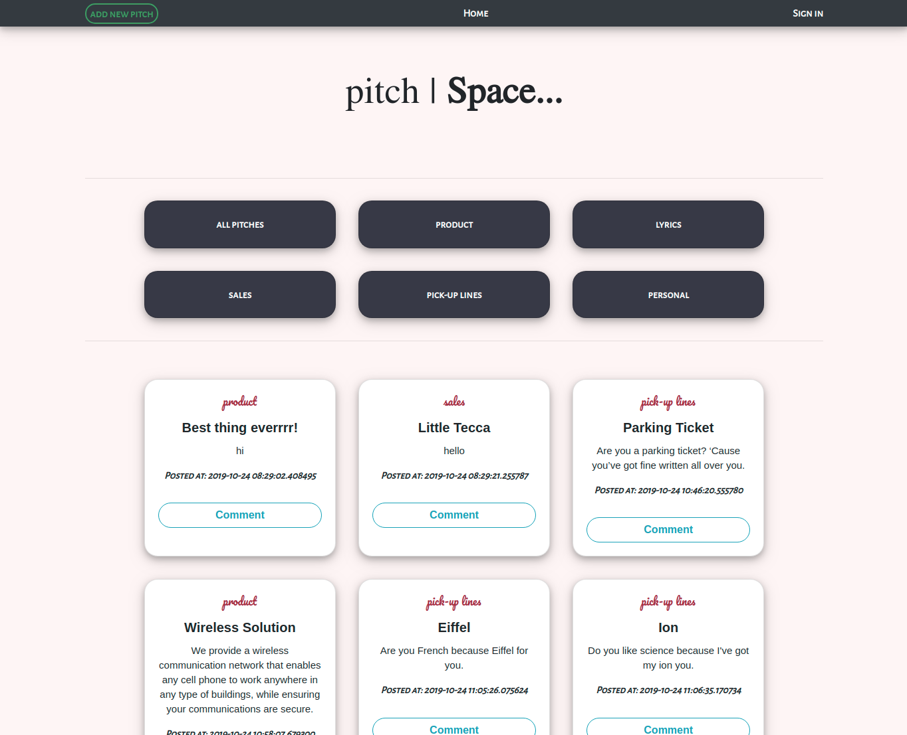

# GitHub Search

### Author
 **[Isaac Gichuru.](https://github.com/Isaacg94)**

## Description

A web application made using Python's Flask that allows a user to submit their minute pitches, on various categrories after creating an account on the webpage.

**[Live-Link to site.](https://world-news-highlights.herokuapp.com/)**
## Features
* A landing page with a list of all the posted pitches.
* A display of the various pitch categories.
* A navigation bar with a link to add a new pitch, a link to navigate back to the landing page, a link to sign-in into an existing account, a link to your profile and a link to sign-out.

## Behaviour Driven Development (BDD)
|Behaviour 	           |    Input 	                 |       Output          |
|----------------------------------------------|:-----------------------------------:|-----------------------------:|       
|    Page loads, landing page with a list of all the posted pitches appears.    |    The user, after signing-up or signing-into their account, can click on add new, to submit their own pitches.   |    The pitch they create is added to the list of pitches in the landing page along with it's category details and time submitted.    |                       |

## Setup/Installation Requirements
Here is a run through of how to set up the application:
* Step 1 : Clone this repository using the git clone link:
  * **`git clone https://github.com/Isaacg94/one-minute-pitch.git`**
* Step 2 : Navigate to the directory:
  * **`cd one-minute-pitch-master`**
* Step 3 : Open the directory created with your favorite IDE. If Atom type **`atom .`** if VSCode type **`code .`** . This will lauch the editor with the project setup,
* Now feel free to hack around the project.

## Known Bugs
* Currently the pitch categories links do not navigate to their respective pitch lists.

## Technologies Used

- Python 3.6.8
- HTML
- CSS
- Bootstrap 4.3.1

## Support and contact details

Primary E-mail Address: 7248zack@gmail.com

### License
*MIT License* 

Copyright (c) 2019 **Isaac Gichuru**